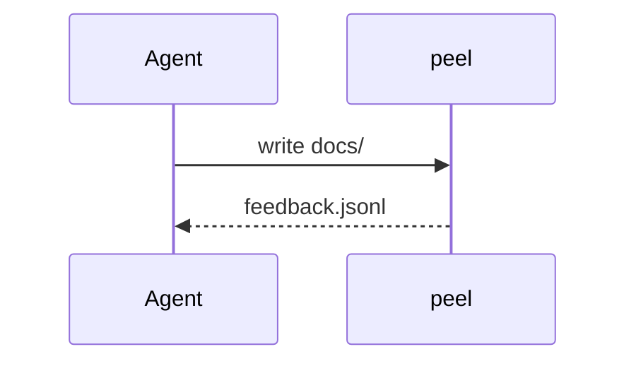

# Demo deck

First slide — architecture at a glance.

---

## Diagram slide

```mermaid
sequenceDiagram
  participant A as Agent
  participant P as peel
  A->>P: write docs/
  P-->>A: feedback.jsonl
```

---

## Bottlenecks

- Rendering
- Watching
- Annotating
